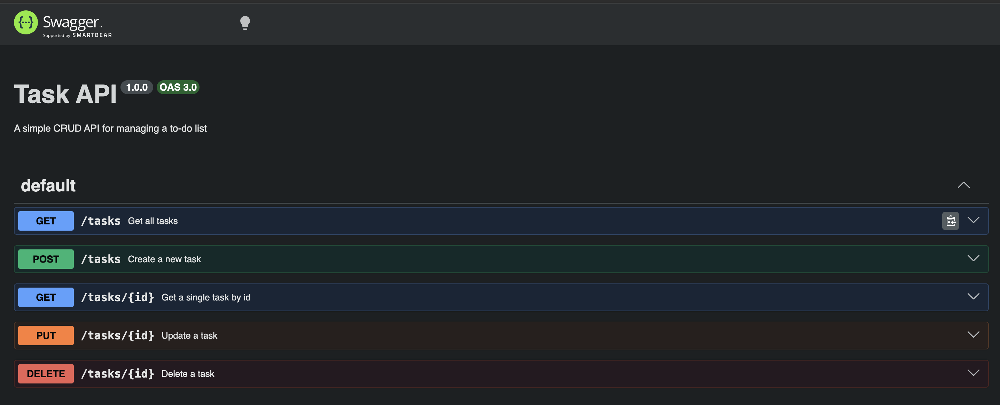

# Task API

A simple CRUD API for managing a to-do list, built with Node.js and Express.

## How to run

```
npm install
node server.js
```

The server runs at `http://localhost:3000`. Interactive docs available at `http://localhost:3000/docs`.

## Endpoints

| Method | Path         | Description              |
|--------|--------------|---------------------------|
| GET    | /            | API info                  |
| GET    | /health      | Health check               |
| GET    | /tasks       | List all tasks              |
| GET    | /tasks/:id   | Get a single task            |
| POST   | /tasks       | Create a new task             |
| PUT    | /tasks/:id   | Update a task                  |
| DELETE | /tasks/:id   | Delete a task                    |

## Example request

```
curl -i http://localhost:3000/tasks/1
```

```
HTTP/1.1 200 OK
Content-Type: application/json; charset=utf-8

{"id":1,"title":"Buy milk","done":false}
```

## Swagger UI



## Notes

Data is stored in memory only — it resets whenever the server restarts.
